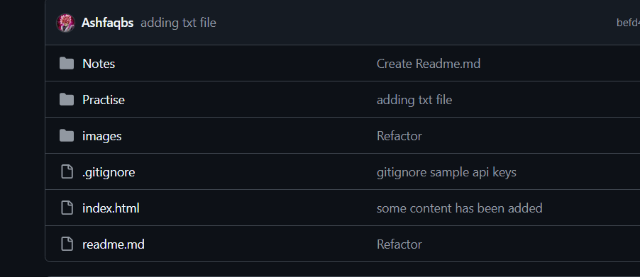

### Undo Git accidental add 

```
git add roughnotes.txt

The file is staged now, which is not required to push to the repo lets unstage it .

git restore --staged
roughnotes.txt


verify with git status 


```


## Understanding How GitIgnore works :

- Create a .gitignore file in root of the project.
- add some files or folders to ignore in the .gitignore file eg .env and SampleAPIKeys folder eg:

```
# in the .gitignore file
.env

SampleAPIKeys/

```
and commit the changes. and in the repo we can see the .gitignore file but not the .env file and SampleAPIKeys folder


